# Payment Gateway API - Flow Diagram

## Complete Payment Lifecycle Flow

```mermaid
sequenceDiagram
    participant Merchant as Merchant/Client
    participant API as API Controller<br/>(PaymentsController)
    participant Auth as API Key Guard
    participant PaymentService as Payment Service<br/>(PaymentsService)
    participant IntentService as Intent Service<br/>(IntentService)
    participant DB as PostgreSQL<br/>(Prisma)
    participant StateMachine as State Machine<br/>(PaymentStateMachineService)
    participant Blockchain as Blockchain Service<br/>(BlockchainService)
    participant Settlement as Settlement Service<br/>(SettlementService)
    participant Audit as Audit Service<br/>(AuditService)
    participant Events as Event System<br/>(EventEmitter)
    participant Logger as Winston Logger

    Note over Merchant,Logger: ========== CREATE PAYMENT INTENT ==========
    
    Merchant->>API: POST /payment-intents<br/>{amount, currency, type, settlementMethod, ...}
    API->>Auth: Validate API Key (X-API-Key header)
    Auth->>DB: Query Merchant by API Key
    DB-->>Auth: Merchant record
    Auth-->>API: Merchant authenticated
    API->>PaymentService: createIntent(dto, merchantId)
    PaymentService->>IntentService: createIntent(dto, merchantId)
    
    IntentService->>DB: Validate settlement method
    IntentService->>DB: Validate compliance
    IntentService->>DB: Generate intent ID & EIP-712 typedData
    
    IntentService->>StateMachine: Validate INITIATED status
    StateMachine-->>IntentService: Valid
    
    IntentService->>DB: CREATE PaymentIntent<br/>{id, merchantId, status: INITIATED, phases: [SIGNATURE_VERIFICATION: IN_PROGRESS], ...}
    DB-->>IntentService: PaymentIntent created
    
    IntentService->>Audit: logIntentCreated(...)
    Audit->>DB: CREATE AuditLog<br/>{eventType: INTENT_CREATED, category: LIFECYCLE, ...}
    DB-->>Audit: AuditLog created
    
    IntentService->>Events: emitIntentCreated(...)
    Events->>Logger: Log payment_intent.created event
    
    IntentService-->>PaymentService: PaymentIntentEntity
    PaymentService-->>API: PaymentIntentEntity
    API->>Logger: HTTP Request Log (Winston)
    API-->>Merchant: 200 OK<br/>{id, status: INITIATED, typedData, phases, ...}

    Note over Merchant,Logger: ========== CONFIRM PAYMENT INTENT ==========
    
    Merchant->>API: POST /payment-intents/:id/confirm<br/>{signature, payerAddress}
    API->>Auth: Validate API Key
    Auth-->>API: Merchant authenticated
    API->>PaymentService: confirmIntent(id, dto, merchantId)
    PaymentService->>IntentService: confirmIntent(id, signature, payerAddress, merchantId)
    
    IntentService->>DB: SELECT PaymentIntent WHERE id = ?
    DB-->>IntentService: PaymentIntent record
    IntentService->>IntentService: Verify merchant owns intent
    
    IntentService->>StateMachine: transition(INITIATED → PROCESSING)
    StateMachine-->>IntentService: Valid transition
    
    IntentService->>IntentService: verifyTypedData(signature, typedData, payerAddress)
    alt Signature Invalid
        IntentService-->>PaymentService: Error: signature_verification_failed
        PaymentService-->>API: 400 Bad Request
        API-->>Merchant: 400 Error
    end
    
    IntentService->>Blockchain: submitDvP() or submitConsentedPull()
    Blockchain->>Blockchain: Submit transaction to Ethereum
    Blockchain-->>IntentService: {transactionHash, contractAddress, chainId}
    
    IntentService->>DB: UPDATE PaymentIntent<br/>{status: PROCESSING, signature, signerAddress, transactionHash, phases: [SIGNATURE_VERIFICATION: COMPLETED, BLOCKCHAIN_CONFIRMATION: IN_PROGRESS], ...}
    DB-->>IntentService: PaymentIntent updated
    
    IntentService->>Audit: logBlockchainTxSubmitted(...)
    Audit->>DB: CREATE AuditLog<br/>{eventType: BLOCKCHAIN_TX_SUBMITTED, category: ON_CHAIN, ...}
    
    IntentService->>Events: emitBlockchainTxSubmitted(...)
    Events->>Logger: Log blockchain_tx_submitted event
    
    IntentService->>Events: emitStatusChanged(...)
    Events->>Logger: Log status_changed event
    
    IntentService-->>PaymentService: PaymentIntentEntity (PROCESSING)
    PaymentService-->>API: PaymentIntentEntity
    API->>Logger: HTTP Request Log
    API-->>Merchant: 200 OK<br/>{id, status: PROCESSING, transactionHash, phases, ...}

    Note over Merchant,Logger: ========== GET PAYMENT INTENT (Polling) ==========
    
    Merchant->>API: GET /payment-intents/:id
    API->>Auth: Validate API Key
    Auth-->>API: Merchant authenticated
    API->>PaymentService: getIntent(id, merchantId)
    PaymentService->>IntentService: getIntent(id, merchantId)
    
    IntentService->>DB: SELECT PaymentIntent WHERE id = ?
    DB-->>IntentService: PaymentIntent (status: PROCESSING)
    IntentService->>IntentService: Verify merchant owns intent
    
    alt Status is PROCESSING and has transactionHash
        IntentService->>Blockchain: getConfirmations(transactionHash)
        Blockchain->>Blockchain: Query Ethereum blockchain
        Blockchain-->>IntentService: confirmations count
        
        alt Confirmations >= 5
            IntentService->>StateMachine: transition(PROCESSING → SUCCEEDED)
            StateMachine-->>IntentService: Valid transition
            
            IntentService->>DB: UPDATE PaymentIntent<br/>{status: SUCCEEDED, phases: [BLOCKCHAIN_CONFIRMATION: COMPLETED, SETTLEMENT: IN_PROGRESS], settlementStatus: IN_PROGRESS, ...}
            DB-->>IntentService: PaymentIntent updated
            
            IntentService->>Audit: logBlockchainTxConfirmed(...)
            Audit->>DB: CREATE AuditLog<br/>{eventType: BLOCKCHAIN_TX_CONFIRMED, category: ON_CHAIN, ...}
            
            IntentService->>Events: emitBlockchainTxConfirmed(...)
            Events->>Logger: Log blockchain_tx_confirmed event
            
            IntentService->>Events: emitStatusChanged(...)
            
            IntentService->>Settlement: startSettlementProcessing(...) [ASYNC, fire-and-forget]
            Note over Settlement: Settlement runs asynchronously<br/>using setTimeout (no job queue)
        end
    end
    
    alt Status is SUCCEEDED and settlement is IN_PROGRESS
        IntentService->>IntentService: checkAndProcessSettlement()
        IntentService->>IntentService: Check if delay elapsed
        
        alt Delay elapsed (OFF_RAMP_MOCK)
            IntentService->>Settlement: processOffRampMock(destination, amount, currency)
            Settlement-->>IntentService: {success: true, transactionId}
            
            IntentService->>StateMachine: transition(SUCCEEDED → SETTLED)
            StateMachine-->>IntentService: Valid transition
            
            IntentService->>DB: UPDATE PaymentIntent<br/>{status: SETTLED, settlementStatus: COMPLETED, phases: [SETTLEMENT: COMPLETED], ...}
            DB-->>IntentService: PaymentIntent updated
            
            IntentService->>Audit: logSettlementCompleted(...)
            Audit->>DB: CREATE AuditLog<br/>{eventType: SETTLEMENT_COMPLETED, category: OFF_RAMP, ...}
            
            IntentService->>Events: emitSettlementCompleted(...)
            Events->>Logger: Log settlement_completed event
            
            IntentService->>Events: emitStatusChanged(...)
        end
    end
    
    IntentService-->>PaymentService: PaymentIntentEntity
    PaymentService-->>API: PaymentIntentEntity
    API->>Logger: HTTP Request Log
    API-->>Merchant: 200 OK<br/>{id, status, settlementStatus, phases, ...}

    Note over Merchant,Logger: ========== SETTLEMENT PROCESSING (Background) ==========
    
    Note over Settlement: Async Settlement Flow (No Job Queue - Current Limitation)
    
    Settlement->>Settlement: Wait for OFF_RAMP_MOCK_DELAY (default: 10s)
    Settlement->>Settlement: processOffRampMock(destination, amount, currency)
    Settlement->>Settlement: Generate mock transaction ID
    
    Settlement->>DB: UPDATE PaymentIntent<br/>{status: SETTLED, settlementStatus: COMPLETED, phases: [SETTLEMENT: COMPLETED], ...}
    DB-->>Settlement: PaymentIntent updated
    
    Settlement->>Audit: logSettlementCompleted(...)
    Audit->>DB: CREATE AuditLog<br/>{eventType: SETTLEMENT_COMPLETED, ...}
    
    Settlement->>Events: emitSettlementCompleted(...)
    Events->>Logger: Log settlement_completed event
```



## Key Flow Points

### 1. Authentication & Authorization
- Every request goes through API Key Guard
- Merchant lookup from database
- Merchant isolation: merchants can only access their own payment intents

### 2. State Machine Validation
- All status transitions validated through PaymentStateMachineService
- Invalid transitions throw BadRequestException
- Ensures data consistency and business rule enforcement

### 3. Audit Trail
- Every significant event logged to AuditLog table
- Includes: INTENT_CREATED, BLOCKCHAIN_TX_SUBMITTED, BLOCKCHAIN_TX_CONFIRMED, SETTLEMENT_INITIATED, SETTLEMENT_COMPLETED, STATUS_CHANGED

### 4. Event System
- Events emitted for all lifecycle changes
- Events logged via Winston
- Extensible for webhooks, notifications, analytics

### 5. Settlement Processing (Current Limitation)
- **No job queue**: Uses setTimeout with Promise
- **No persistence**: Jobs lost on server restart
- **No retries**: Failed settlements not retried
- **Opportunistic completion**: Relies on getIntent calls to check status
- **TODO**: Should use BullMQ/Bull with Redis for production

### 6. Blockchain Integration
- EIP-712 signature verification
- Transaction submission to Ethereum (Sepolia)
- Confirmation polling (5+ confirmations required)
- Transaction hash and contract address tracking

## Data Flow Summary

```
Merchant Request
    ↓
API Key Authentication (Guard)
    ↓
Payment Controller
    ↓
Payment Service (Orchestration)
    ↓
Intent Service (Business Logic)
    ├──→ State Machine (Validation)
    ├──→ Database (Prisma/PostgreSQL)
    ├──→ Blockchain Service (On-chain ops)
    ├──→ Settlement Service (Off-ramp)
    ├──→ Audit Service (Logging)
    └──→ Event System (Events)
        └──→ Winston Logger (Structured logs)
    ↓
Response to Merchant
```

## Status Transition Flow

```
INITIATED
    ↓ (confirm with signature)
PROCESSING
    ↓ (5+ blockchain confirmations)
SUCCEEDED
    ↓ (settlement completes)
SETTLED
    ↓ (finalize)
FINAL

[Error paths: CANCELED, REQUIRES_ACTION, FAILED]
```

